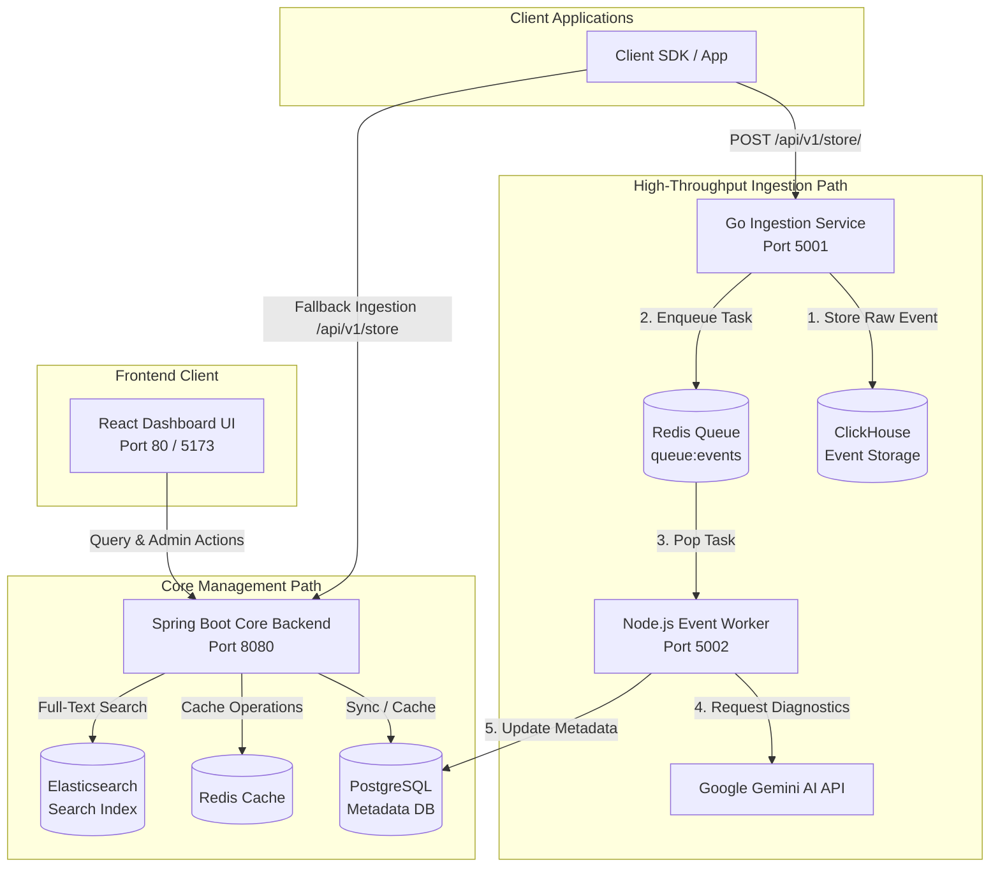

# FixIt Hub 🛠️ (Universal Error & Bug Resolution Hub)

An AI-powered, self-hosted, real-time error tracking and exception monitoring system designed to help developers capture, diagnose, and resolve application bugs instantly.

---

## 🏗️ Architecture & Data Flow

FixIt Hub implements two main data flow paths: a **High-Throughput Analytics & AI Diagnostics Path** for asynchronous exception streams, and a **Direct Management REST Path** for full-text search, user operations, settings, and dashboards.



---

## 📂 Repository Layout

The project is structured as a monorepo containing multiple key workspaces and service layers:

- **[frontend/](file:///c:/Universal%20Error%20&%20Bug%20Resolution%20Hub/frontend)**: A React-based SPA dashboard built with React 19, Vite, TypeScript, and TailwindCSS v4.
- **[backend/](file:///c:/Universal%20Error%20&%20Bug%20Resolution%20Hub/backend)**: The core management service built with Spring Boot 3, Java 21, Spring Security (JWT), and Flyway database migrations.
- **[apps/ingestion/](file:///c:/Universal%20Error%20&%20Bug%20Resolution%20Hub/apps/ingestion)**: A lightweight, high-performance Go ingestion daemon that records raw exception logs to ClickHouse and publishes job messages to Redis.
- **[apps/api/](file:///c:/Universal%20Error%20&%20Bug%20Resolution%20Hub/apps/api)**: Node.js worker and API container responsible for processing enqueued ingestion jobs, calculating issue deduplication fingerprints, and invoking Gemini AI for root-cause analyses.
- **[docker-compose.yml](file:///c:/Universal%20Error%20&%20Bug%20Resolution%20Hub/docker-compose.yml)**: Configures and spins up the multi-container Docker stack including PostgreSQL, Redis, Elasticsearch, the Java backend, and the React frontend.

---

## 🛠️ Technology Stack

| Component | Technology | Primary Role |
| :--- | :--- | :--- |
| **Frontend** | React 19, TypeScript, Vite, TailwindCSS v4, TanStack Query, Lucide Icons | User & Admin Dashboard |
| **Backend** | Spring Boot 3, Java 21, Spring Security, Flyway, JPA / Hibernate | Management API, Full-Text Search, Auth |
| **Ingestion** | Go 1.21 | High-throughput Log Ingest |
| **Worker** | Node.js, Express, TypeScript, Google Generative AI SDK | Queue Processor & AI Diagnostics Integration |
| **Datastores** | PostgreSQL 15, Redis 7, ClickHouse, Elasticsearch 8 | Transactional Metadata, Queues/Cache, Event Analytics, Log Search |

---

## ⚙️ Environment Configuration

Define a `.env` file at the root of the workspace. A template is provided in [.env](file:///c:/Universal%20Error%20&%20Bug%20Resolution%20Hub/.env):

| Variable | Description | Default Value |
| :--- | :--- | :--- |
| `DB_HOST` | PostgreSQL Host Address | `postgres` (or `localhost` for local run) |
| `DB_PORT` | PostgreSQL Service Port | `5432` |
| `DB_NAME` | Metadata Database Name | `fixit_metadata` |
| `DB_USER` | PostgreSQL Username | `postgres` |
| `DB_PASSWORD`| PostgreSQL Password | `postgrespassword` |
| `REDIS_HOST` | Redis Server Hostname | `redis` (or `localhost` for local run) |
| `REDIS_PORT` | Redis Server Port | `6379` |
| `ELASTICSEARCH_URIS` | Elasticsearch URI Connection String | `http://elasticsearch:9200` |
| `JWT_SECRET` | Secret key for generating JSON Web Tokens | *(Base64 encoded 256-bit token)* |
| `JWT_EXPIRATION_MS` | JWT validity duration | `86400000` (24 Hours) |
| `GEMINI_API_KEY` | API key for Google Generative AI | *(Empty - optional fallback diagnostics run)* |
| `GEMINI_MODEL` | Gemini AI model version used for diagnostics | `gemini-1.5-flash` |
| `PORT` | Spring Boot Core Service Port | `8080` |

---

## 🚀 Running the Application

### 🐳 1. Using Docker Compose (Recommended)

To spin up all services together, run the following command at the workspace root:

```bash
docker-compose up --build -d
```

This brings up:
- **PostgreSQL** on `5432`
- **Redis** on `6379`
- **Elasticsearch** on `9200`
- **Spring Boot Backend** on `8080` (API documentation accessible at `http://localhost:8080/swagger-ui.html`)
- **React Frontend** on `80` (Dashboard accessible at `http://localhost`)

---

### 💻 2. Local Development Setup

If running components locally for development:

#### **Step A: Datastores**
Launch PostgreSQL, Redis, ClickHouse, and Elasticsearch locally or run only the datastore containers via Docker:
```bash
docker-compose up -d postgres redis elasticsearch
```

#### **Step B: Ingestion Service (Go)**
1. Navigate to `/apps/ingestion`
2. Run using:
   ```bash
   go run main.go
   ```

#### **Step C: Event Worker & API (Node.js)**
From the root directory, install dependencies and start the dev process:
```bash
npm run install:all
npm run dev:api
```

#### **Step D: Core Backend (Spring Boot)**
1. Navigate to `/backend`
2. Launch using Maven:
   ```bash
   mvn spring-boot:run
   ```

#### **Step E: Frontend Dashboard (Vite + React)**
From the root directory:
```bash
npm run dev:web
```
The client dashboard will be available at `http://localhost:5173`.
